# Minor planet orbits and the use of minor planet nomenclature in news articles: computational materials for publication

raw data and all code

### Download a nicely formatted htm version of this readme.md by choosing 
### Calculations Output v3.zip above 
### or go to the original computational file by choosing 
### 95PercentCIMinorPlanetGoogleNews11SpecialPointsPublicv3.nb above which is in Mathematica Wolfram language. ###

For a reference see https://reference.wolfram.com/language/guide/Wavelets.html

NEWS PRESENCE OF ASTEROID NAMES RELATES TO ANGLES TO SPECIAL POINTS

\-- COLLECTION STARTED ON FEB 15, 2022-- EVALUATED DAILY UNTIL DEC 1, 2023 --

 

 

 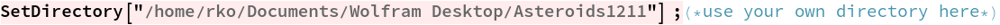

 Collection of Data

 

 Normalize and then average the daily article count across all individual minor planets

 Extract Dates from Imported Data

 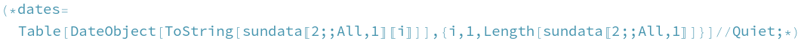

 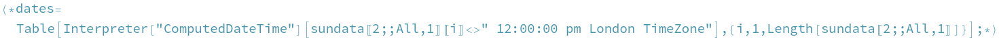

 

 

 

 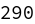

 degrees-Sun -(SPECIALPOINT -Sun) = degrees - SPECIALPOINT

 

 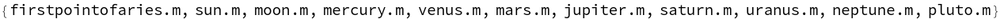

 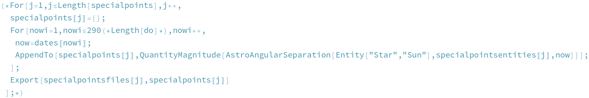

 

 

 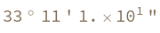

 Mesarthim was chosen as it is (currently) the closest fixed star to Sidereal placement to the Sun at the point of the Vernal Equinox . It does move but very slowly over the course of thousands of years . All other fixed reference points (such as the first point of Aries, etc). should just represent a phase-shift to the Mesarthim data. As such, the Mesarthim analysis below for peak period and frequency identification, and so on applies equally to any fixed point of the zodiac.

 Check whether dates are sampled regularly day by day and check number of dates

 

 

 

 

 Extract Article Counts and Angles of Namesakes to Special Points By Degree

 

 

 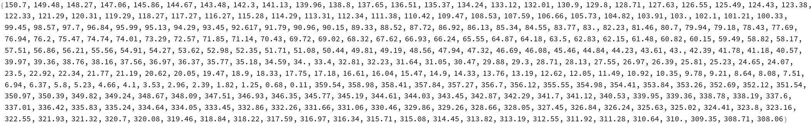

 

 

 

 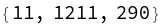

 For Each Minor Planet Studied, Construct Time Series for the Normalized Article Counts

 

 

 Look at an Example, the Second One, for a Time Series of the Number of Articles Per Day

 

 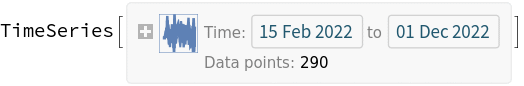

 

 

 Similarly, Construct a Time Series for the Rounded Angular Degrees to Each Special Point for Each Minor Planet

 

 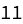

 

 

 

 

 

 

 

 

 

 

 

 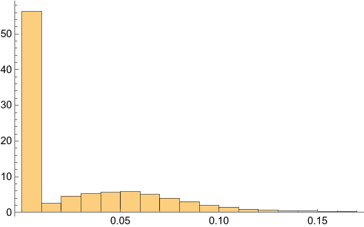

 Now, combine angles and article counts.

 

 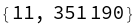

 

 

 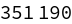

 

 

 Calculate the average normalized article count per rounded degree.

 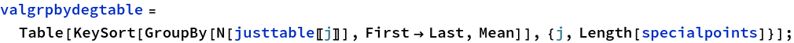

 

 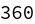

 Filter Data

 

 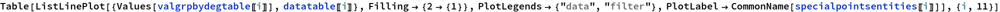

 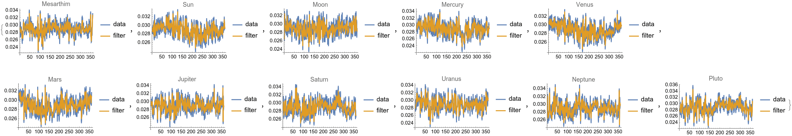

 

 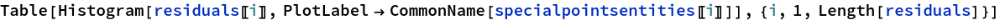

 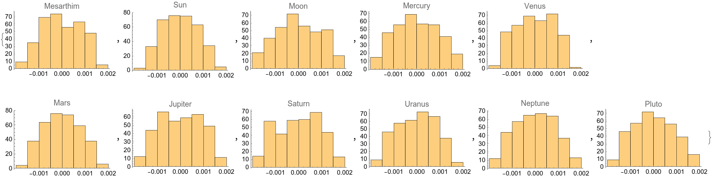

 Test for randomness in filtered data

 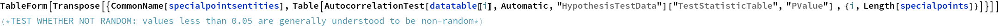

  Mesarthim      Statistic   Ljung-Box 125.958 9.11442\*10^^-25 

   Sun      Statistic   Ljung-Box 294.864 1.03087\*10^^-60 

   Moon      Statistic   Ljung-Box 105.809 1.53568\*10^^-20 

   Mercury      Statistic   Ljung-Box 241.016 3.40645\*10^^-49 

   Venus      Statistic   Ljung-Box 427.296 3.77017\*10^^-89 

   Mars      Statistic   Ljung-Box 282.834 3.88604\*10^^-58 

   Jupiter      Statistic   Ljung-Box 141.619 4.56394\*10^^-28 

   Saturn      Statistic   Ljung-Box 321.568 1.94682\*10^^-66 

   Uranus      Statistic   Ljung-Box 208.179 3.44001\*10^^-42 

   Neptune      Statistic   Ljung-Box 199.374 2.57884\*10^^-40 

   Pluto      Statistic   Ljung-Box 345.258 1.60865\*10^^-71 

 

 Test for stationarity in filtered data

 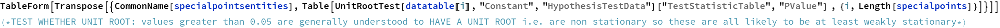

  Mesarthim      Statistic   Dickey-Fuller F -182.787 1.25284\*10^^-11 

  Sun      Statistic   Dickey-Fuller F -125.891 4.96421\*10^^-10 

  Moon      Statistic   Dickey-Fuller F -177.957 1.63147\*10^^-11 

  Mercury      Statistic   Dickey-Fuller F -126.903 4.58685\*10^^-10 

  Venus      Statistic   Dickey-Fuller F -139.311 1.82631\*10^^-10 

  Mars      Statistic   Dickey-Fuller F -142.579 1.45266\*10^^-10 

  Jupiter      Statistic   Dickey-Fuller F -181.7 1.32873\*10^^-11 
  
  Saturn      Statistic   Dickey-Fuller F -130.321 3.52829\*10^^-10 

  Uranus      Statistic   Dickey-Fuller F -139.319 1.82519\*10^^-10 

  Neptune      Statistic   Dickey-Fuller F -153.357 7.0777\*10^^-11 

  Pluto      Statistic   Dickey-Fuller F -95.8932 7.30495\*10^^-9 

 

 Look at correlograms of filtered data

 

 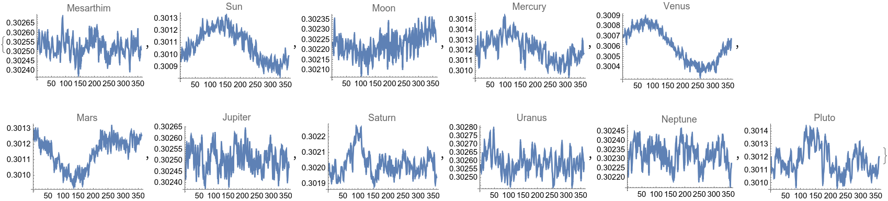

 Note that Fourier Transforms of filtered data show frequency peaks, the periods of which match the divisors of major astrological angles (trines, squares, quintiles, deciles,Golden angles)

 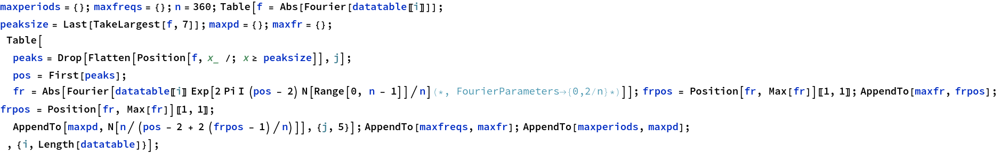

 

 

 

 

 

 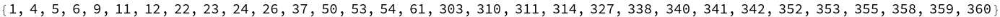

 

 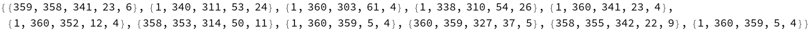

 

 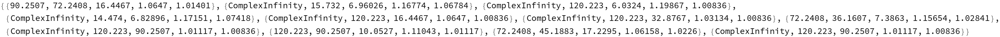

 

  Mesarthim   90 72 16 1 1 

   Sun   ComplexInfinity 16 7 1 1 

   Moon   ComplexInfinity 120 6 1 1 

   Mercury   ComplexInfinity 14 7 1 1 

   Venus   ComplexInfinity 120 16 1 1 

   Mars   ComplexInfinity 120 33 1 1 

   Jupiter   72 36 7 1 1 

   Saturn   ComplexInfinity 120 90 1 1 

   Uranus   120 90 10 1 1 

   Neptune   72 45 17 1 1 

   Pluto   ComplexInfinity 120 90 1 1 

 

 

 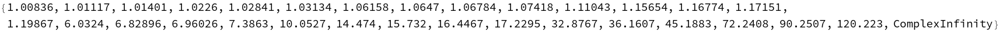

 

 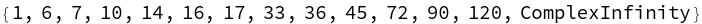

 

 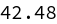

 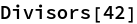

 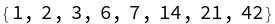

 

 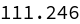

 

 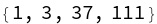

 

 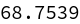

 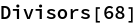

 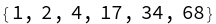

 Natures are given in https://www.astro.com/astrology/in\_aspect\_e.htm.

 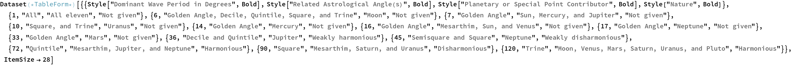

 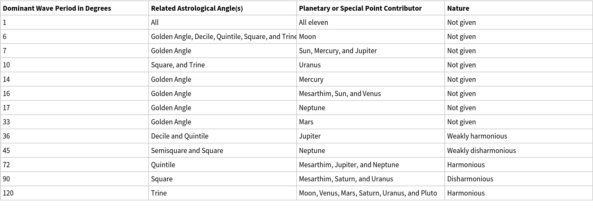

 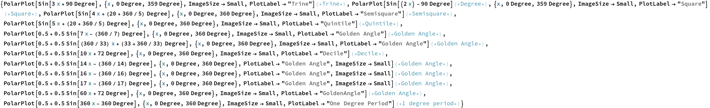

 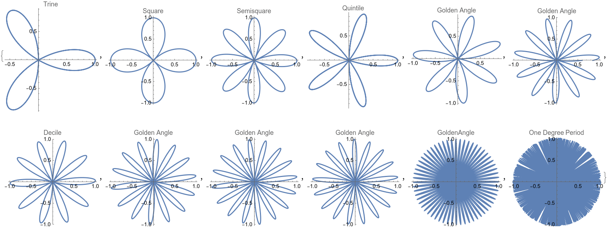

 Every special point contributes something.  
  
And when you add the main angles together (multiplying by the number of planets represented and skipping the Golden angles and Mesarthim for now) with an appropriately sized reference circle for convenience, you get something like the famous Gauquelin sectors image.

 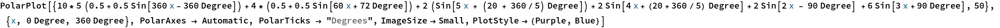

 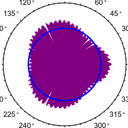

 Rotate to match the default mathematical angle presentation to that for a Tropical astrological chart.

 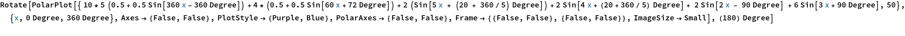

 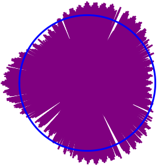

 Compare to the famous Gauquelin sectors chart below which is in the standard Tropical chart format. (Image at https://newalchemypress.com/gauquelin/gauquelin\_docs/images/4e.jpg. See https://newalchemypress.com/gauquelin/ for more information.)

 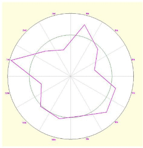

 Not a perfect match, but food for thought.

 Look at power spectral densities of filtered data to see peak frequencies

 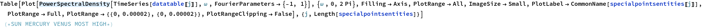

 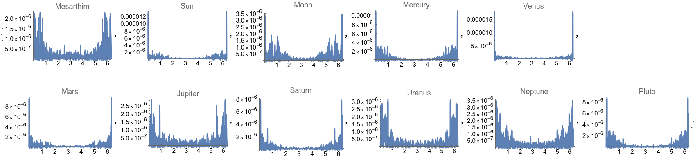

 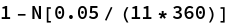

 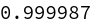

 Create an ACF (autocorrelation function) plot with white-noise confidence bands 

 

 

 

 

 

 

 

 

 

 

 

  Mesarthim   1 2 3 4 16 19 40 41 43 45 56 57 58 92 93 152 154 259 

   Sun   1 2 3 4 5 6 7 8 9 10 11 12 13 14 15 16 17 18 19 20 21 22 23 24 25 26 27 28 29 30 31 32 33 34 35 36 37 38 39 40 41 44 45 46 47 48 49 50 51 52 53 54 55 56 60 62 63 64 65 66 67 68 70 71 72 104 105 109 110 111 117 118 123 124 125 127 128 129 132 135 136 137 138 139 140 143 144 145 146 149 150 154 155 156 157 158 159 160 161 162 163 164 165 166 167 168 169 170 171 172 173 174 175 176 177 178 179 180 181 182 183 184 185 186 187 190 191 192 193 194 195 196 203 204 207 208 209 210 

   Moon   1 2 7 8 11 12 13 14 17 18 19 23 24 31 108 133 223 224 225 235 236 237 

   Mercury   1 2 3 4 5 6 7 8 9 10 11 12 13 14 15 16 17 18 21 27 28 29 30 31 33 35 36 37 40 41 42 43 44 48 56 61 62 75 76 77 78 90 91 114 115 128 129 142 143 156 157 158 159 167 168 169 182 183 184 185 186 191 192 193 197 204 215 216 219 

   Venus   1 2 3 4 5 6 7 8 9 10 11 12 13 14 15 16 17 18 19 20 21 22 23 24 25 26 27 28 29 30 31 32 33 34 35 36 37 38 39 40 41 42 43 44 45 46 47 48 49 50 51 52 53 54 55 56 57 59 60 62 64 65 66 67 68 69 70 71 75 80 120 127 128 129 133 134 135 136 138 139 140 141 142 143 144 145 146 147 148 149 150 151 152 153 154 155 156 157 158 159 160 161 162 163 164 165 166 167 168 169 170 171 172 173 174 175 176 177 178 179 180 181 182 183 184 185 186 187 188 189 190 191 192 193 194 195 196 197 198 199 200 201 202 203 204 205 206 207 208 209 210 211 212 213 214 215 216 217 218 219 220 221 222 223 224 228 229 230 231 232 233 235 236 237 242 243 

   Mars   1 2 3 4 5 6 7 8 9 10 11 12 13 14 15 16 17 19 20 21 22 23 24 25 26 27 28 29 30 31 32 33 34 35 36 37 38 40 44 45 46 97 101 102 103 104 105 106 107 110 111 125 131 132 150 151 152 153 154 155 156 157 158 159 160 161 162 163 164 176 190 191 195 196 

   Jupiter   1 2 3 4 5 7 8 16 27 28 34 35 57 58 59 83 203 204 230 

   Saturn   1 2 3 4 5 6 7 8 9 10 11 12 13 14 15 16 21 22 23 24 38 48 49 50 51 52 56 57 58 59 60 61 62 65 124 125 126 135 145 146 147 154 155 156 157 165 166 167 168 204 205 206 207 212 213 254 

   Uranus   1 2 3 4 26 27 28 56 57 58 59 92 117 118 215 

   Neptune   1 2 3 4 5 6 7 8 15 16 27 28 33 34 41 42 43 48 49 202 203 

   Pluto   1 2 3 4 5 6 7 8 9 10 11 12 13 14 15 16 19 20 21 22 23 24 25 26 27 55 56 57 58 59 60 65 66 77 78 144 145 146 155 156 161 197 199 200 201 254 255 

 

 Create a PACF (partial autocorrelation function) plot with white-noise confidence bands 

 

 

 

 

 

 

 

 

 

 

 

  Mesarthim   1 18 33 

   Sun   1 2 3 4 6 7 24 26 30 

   Moon   1 2 3 6 10 11 12 50 56 67 131 

   Mercury   1 2 34 49 75 181 

   Venus   1 2 4 5 13 34 75 87 

   Mars   1 3 4 7 18 94 113 

   Jupiter   1 6 15 56 222 

   Saturn   1 5 7 37 42 48 51 119 161 

   Uranus   1 90 115 

   Neptune   1 4 39 51 92 183 

   Pluto   1 2 8 15 23 54 174 

 

 [ Created with the Wolfram Language ](http://www.wolfram.com/language/)
